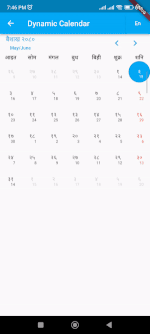
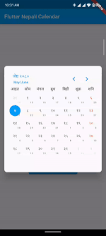

# nepali_calx

[](https://pub.dev/packages/nepali_calx)
[](https://opensource.org/licenses/MIT)
[](https://flutter.dev)

A modern, versatile, and highly customizable Flutter calendar package that seamlessly switches between **Nepali Date (Bikram Sambat - BS)** and **English Date (Anno Domini - AD)**. It features dual-date cell indicators, holidays, dynamic events, and a built-in calendar dialog picker.

---

## 📱 Preview

|                            Basic Calendar                            |                        Dynamic Switch (BS ⇄ AD)                         |                      Calendar Dialog Picker                      |
| :------------------------------------------------------------------: | :---------------------------------------------------------------------: | :--------------------------------------------------------------: |
|  |  |  |

---

## ✨ Features

- 🔄 **Dual Calendar System**: Seamless support for both Bikram Sambat (`BS`) and Gregorian (`AD`) dates.
- 🗓️ **Dual-Date Display**: Simultaneously displays the primary date with the corresponding alternate calendar date in each cell.
- ⚡ **Dynamic Switching**: Switch between `BS` and `AD` views on the fly without resetting state or losing selections.
- 🏖️ **Holidays Highlighting**: Highlight official and custom holidays with distinct colors and styling.
- 📌 **Event Indicators**: Attach custom event objects to dates and display visual event indicators.
- 💬 **Built-in Dialog Picker**: Ready-to-use `showNepaliCalxDialog()` modal picker for quick date selection.
- 🎨 **Extensive Customization**: Customize primary theme colors, weekday headers, today's highlight, selected day decorations, or build custom cells via `dayBuilder`.
- ⚙️ **Flexible Week Layout**: Configure whether the week starts on Sunday or Monday, and customize weekend days.

---

## 📦 Installation

Add `nepali_calx` to your `pubspec.yaml` dependencies:

```bash
flutter pub add nepali_calx
```

Or manually add it to your `pubspec.yaml`:

```yaml
dependencies:
  nepali_calx: ^1.0.0
```

Then run:

```bash
flutter pub get
```

Import the package in your Dart code:

```dart
import 'package:nepali_calx/nepali_calx.dart';
```

---

## 🚀 Quick Start

A minimal setup to render the calendar in your Flutter application:

```dart
import 'package:flutter/material.dart';
import 'package:nepali_calx/nepali_calx.dart';

class SimpleCalendarPage extends StatelessWidget {
  const SimpleCalendarPage({super.key});

  @override
  Widget build(BuildContext context) {
    return Scaffold(
      appBar: AppBar(title: const Text('Nepali Calendar')),
      body: NepaliCalx(
        calendarType: CalendarType.bs, // CalendarType.bs or CalendarType.ad
        initialDate: DateTime.now(),
        firstDate: DateTime(1970),
        lastDate: DateTime(2030),
        onDateSelected: (date, events) {
          debugPrint('Selected date: $date');
        },
        onMonthChanged: (date, events) {
          debugPrint('Month changed to: $date');
        },
      ),
    );
  }
}
```

---

## 💡 Usage Examples

### 1. Dynamic Calendar Switching (BS ⇄ AD)

Switch dynamically between Bikram Sambat (BS) and English (AD) formats using state management or a simple toggle button:

```dart
class DynamicCalendarPage extends StatefulWidget {
  const DynamicCalendarPage({super.key});

  @override
  State<DynamicCalendarPage> createState() => _DynamicCalendarPageState();
}

class _DynamicCalendarPageState extends State<DynamicCalendarPage> {
  CalendarType _calendarType = CalendarType.bs;
  DateTime? _selectedDate;

  @override
  Widget build(BuildContext context) {
    return Scaffold(
      appBar: AppBar(
        title: const Text('Dynamic Calendar'),
        actions: [
          TextButton(
            onPressed: () {
              setState(() {
                _calendarType = _calendarType == CalendarType.bs
                    ? CalendarType.ad
                    : CalendarType.bs;
              });
            },
            child: Text(
              _calendarType == CalendarType.bs ? 'Switch to AD' : 'Switch to BS',
              style: const TextStyle(color: Colors.white),
            ),
          ),
        ],
      ),
      body: NepaliCalx(
        calendarType: _calendarType,
        initialDate: DateTime.now(),
        firstDate: DateTime(1970),
        lastDate: DateTime(2030),
        onDateSelected: (date, events) {
          setState(() => _selectedDate = date);
        },
      ),
    );
  }
}
```

---

### 2. Events & Holidays

Attach custom event models and mark specific dates as holidays:

```dart
// Custom event data model
class TaskNote {
  final String title;
  TaskNote(this.title);
}

class EventCalendarPage extends StatefulWidget {
  const EventCalendarPage({super.key});

  @override
  State<EventCalendarPage> createState() => _EventCalendarPageState();
}

class _EventCalendarPageState extends State<EventCalendarPage> {
  // Define holiday dates
  final List<DateTime> _holidays = [
    DateTime(2024, 1, 1),
    DateTime(2024, 4, 14),
  ];

  // Define events
  final List<Event<TaskNote>> _events = [
    Event(
      date: DateTime(2024, 4, 14),
      event: TaskNote('Nepali New Year Celebration'),
    ),
    Event(
      date: DateTime(2024, 5, 1),
      event: TaskNote('Labour Day Meeting'),
    ),
  ];

  @override
  Widget build(BuildContext context) {
    return Scaffold(
      appBar: AppBar(title: const Text('Events & Holidays')),
      body: NepaliCalx<TaskNote>(
        calendarType: CalendarType.bs,
        initialDate: DateTime.now(),
        firstDate: DateTime(1970),
        lastDate: DateTime(2030),
        holidays: _holidays,
        events: _events,
        holidayColor: Colors.red,
        eventColor: Colors.deepPurpleAccent,
        onDateSelected: (date, events) {
          debugPrint('Selected date: $date with ${events?.length ?? 0} events');
        },
      ),
    );
  }
}
```

---

### 3. Calendar Dialog Picker

Display the calendar inside a customizable popup dialog to select a date:

```dart
ElevatedButton(
  onPressed: () async {
    final DateTime? pickedDate = await showNepaliCalxDialog(
      context: context,
      calendarType: CalendarType.bs, // Or CalendarType.ad
      initialDate: DateTime.now(),
      firstDate: DateTime(1970),
      lastDate: DateTime(2030),
      primaryColor: Colors.indigo,
      borderRadius: BorderRadius.circular(16),
    );

    if (pickedDate != null) {
      debugPrint('Picked Date: $pickedDate');
    }
  },
  child: const Text('Pick Date via Dialog'),
)
```

---

### 4. Custom Styling & Day Builder

Customize cell highlights, headers, or supply your own builder widget:

```dart
NepaliCalx(
  calendarType: CalendarType.bs,
  initialDate: DateTime.now(),
  firstDate: DateTime(1970),
  lastDate: DateTime(2030),
  primaryColor: Colors.teal,
  weekColor: Colors.blueGrey,
  holidayColor: Colors.redAccent,
  weekendDays: const [DateTime.saturday],
  mondayWeek: false, // false = Sunday start, true = Monday start
  todayDecoration: BoxDecoration(
    color: Colors.teal.withOpacity(0.2),
    borderRadius: BorderRadius.circular(8),
    border: Border.all(color: Colors.teal),
  ),
  selectedDayDecoration: BoxDecoration(
    color: Colors.teal,
    borderRadius: BorderRadius.circular(8),
  ),
  // Optional: Custom day cell widget builder
  dayBuilder: (date) {
    return Center(
      child: Text(
        '${date.day}',
        style: const TextStyle(fontWeight: FontWeight.w600),
      ),
    );
  },
  onDateSelected: (date, events) {},
)
```

---

## 🛠️ API Reference

### `NepaliCalx`

| Property                | Type                         | Default               | Description                                                                |
| :---------------------- | :--------------------------- | :-------------------- | :------------------------------------------------------------------------- |
| `calendarType`          | `CalendarType`               | `CalendarType.bs`     | Calendar system to display (`bs` or `ad`).                                 |
| `initialDate`           | `DateTime`                   | **Required**          | The initially focused date.                                                |
| `firstDate`             | `DateTime`                   | **Required**          | The earliest date allowed for navigation and selection.                    |
| `lastDate`              | `DateTime`                   | **Required**          | The latest date allowed for navigation and selection.                      |
| `onDateSelected`        | `OnSelectedDate`             | **Required**          | Callback invoked when a date cell is tapped `(selectedDate, events)`.      |
| `onMonthChanged`        | `OnMonthChanged?`            | `null`                | Callback invoked when the month is changed `(selectedDate, events)`.       |
| `holidays`              | `List<DateTime>?`            | `null`                | List of dates marked as holidays.                                          |
| `events`                | `List<Event>?`               | `null`                | List of events assigned to specific dates.                                 |
| `mondayWeek`            | `bool`                       | `false`               | If `true`, the week starts on Monday; otherwise starts on Sunday.          |
| `weekendDays`           | `List<int>`                  | `[DateTime.saturday]` | List of weekday indices considered as weekends (e.g. `DateTime.saturday`). |
| `primaryColor`          | `Color?`                     | `null`                | Primary theme color for navigation, titles, and headers.                   |
| `weekColor`             | `Color?`                     | `null`                | Text color for weekday header titles (Sun, Mon, ...).                      |
| `holidayColor`          | `Color?`                     | `null`                | Highlight color for holidays.                                              |
| `eventColor`            | `Color?`                     | `null`                | Color of the event indicator dot.                                          |
| `todayDecoration`       | `BoxDecoration?`             | `null`                | Decoration applied to today's date cell.                                   |
| `selectedDayDecoration` | `BoxDecoration?`             | `null`                | Decoration applied to the currently selected date cell.                    |
| `dayBuilder`            | `Widget Function(DateTime)?` | `null`                | Custom builder function for cell widgets.                                  |

---

### `showNepaliCalxDialog()`

| Parameter            | Type              | Default                     | Description                                   |
| :------------------- | :---------------- | :-------------------------- | :-------------------------------------------- |
| `context`            | `BuildContext`    | **Required**                | The BuildContext to show the dialog.          |
| `calendarType`       | `CalendarType?`   | `CalendarType.bs`           | Calendar type (`bs` or `ad`).                 |
| `initialDate`        | `DateTime?`       | `DateTime.now()`            | Initially selected date.                      |
| `firstDate`          | `DateTime?`       | `DateTime(1970)`            | Earliest selectable date.                     |
| `lastDate`           | `DateTime?`       | `initialDate + 10 yrs`      | Latest selectable date.                       |
| `holidays`           | `List<DateTime>?` | `null`                      | List of holiday dates.                        |
| `events`             | `List<Event>?`    | `null`                      | List of event objects.                        |
| `primaryColor`       | `Color?`          | `null`                      | Primary theme accent color.                   |
| `borderRadius`       | `BorderRadius?`   | `BorderRadius.circular(10)` | Corner radius of the dialog card.             |
| `height`             | `double?`         | Screen width \* 1.1         | Dialog height constraint.                     |
| `barrierDismissible` | `bool`            | `true`                      | Whether tapping outside dismisses the dialog. |

---

## 📂 Example App

A complete runnable Flutter example demonstrating all features (Basic, Dynamic Switch, Features & Events, Dialog) is available in the [`example`](example) directory.

To run the example:

```bash
cd example
flutter run
```

---

## 🤝 Contributing

Contributions, issues, and feature requests are welcome!  
Feel free to open an issue or submit a pull request on the [GitHub repository](https://github.com/crpoudyal/nepali_calx).

---

## 📄 License

This project is licensed under the MIT License - see the [LICENSE](LICENSE) file for details.
